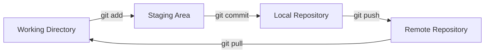

# Initializing Repositories

A Git repository is where your project’s files and version history are stored. This page covers how to initialize and manage repositories in Git.

---

## What is a Repository?

A **repository (repo)** is a folder that Git uses to track changes to files. It can be:
- **Local**: Stored on your computer.
- **Remote**: Hosted on a server like GitHub, GitLab, or Bitbucket for collaboration.

---

## 1. **Creating a New Repository**

### **Steps to Initialize a Repository**
1. Navigate to the directory where you want to create the repository:
   ```bash
   cd /path/to/your/project
   ```

2. Initialize Git in the directory:
   ```bash
   git init
   ```
   This creates a hidden `.git` folder where Git stores metadata about your repository.

3. (Optional) Add files to the repository:
   ```bash
   git add .
   ```

4. Commit the files to create a snapshot:
   ```bash
   git commit -m "Initial commit"
   ```

### **Result**
The directory is now a Git repository, and Git will track changes to files in this folder.

---

## 2. **Cloning an Existing Repository**

If a repository already exists, you can clone it to your local system.

### **Steps to Clone a Repository**
1. Copy the repository URL (e.g., from GitHub or GitLab).
2. Run the `git clone` command:
   ```bash
   git clone https://github.com/username/repository.git
   ```
3. Navigate into the cloned repository:
   ```bash
   cd repository
   ```

### **Result**
You now have a local copy of the repository with its full history.

---

## 3. **Checking Repository Status**

After initializing or cloning a repository, check its status to see untracked or modified files:
```bash
git status
```

---

## 4. **Exploring Repository Structure**

### **The Git Workflow**



### **Key Components of a Git Repository**
1. **Working Directory**: The folder containing your project files.
2. **Staging Area**: Tracks changes you've marked for commit.
3. **Git Directory**: The `.git` folder that contains the repository’s history and configuration.

You can view the contents of the `.git` directory (optional):
```bash
ls -a .git
```

---

## 5. **Connecting a Local Repository to a Remote**

If you’ve initialized a local repository, you can connect it to a remote for collaboration.

### **Steps to Add a Remote Repository**
1. Add the remote repository URL:
   ```bash
   git remote add origin https://github.com/username/repository.git
   ```

2. Push the local repository to the remote:
   ```bash
   git push -u origin main
   ```

### **Result**
Your local changes will now sync with the remote repository.

---

## 6. **Deleting a Repository**

### **To Remove a Local Repository**
Simply delete the `.git` folder:
```bash
rm -rf .git
```
This action uninitializes the repository and removes its history.

---

## Common Commands for Repositories

| Command                          | Description                                        |
|----------------------------------|----------------------------------------------------|
| `git init`                       | Initialize a new Git repository.                  |
| `git clone <url>`                | Clone an existing repository.                     |
| `git remote add origin <url>`    | Add a remote repository.                          |
| `git status`                     | Check the status of the repository.               |
| `git add <file>`                 | Stage changes for commit.                         |
| `git commit -m "message"`        | Commit changes with a message.                    |

---

## Conclusion

Initializing a Git repository is the first step to managing your project with version control. Whether starting fresh or cloning an existing repository, Git provides a flexible and powerful way to track changes and collaborate.

---

**Next Steps**: [Tracking Changes](./2.%20Tracking%20Changes.md)
