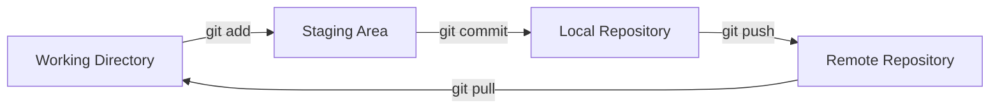

# Git Essentials: A Comprehensive Guide

> A modern, practical guide to Git version control system - from basics to advanced concepts.

💡 **Pro Tip**: Star this repository to keep it handy for future reference!

## 📚 Table of Contents

1. [Introduction](#introduction)
2. [Installation & Setup](#installation--setup)
3. [Core Concepts](#core-concepts)
4. [Essential Commands](#essential-commands)
5. [Working with Branches](#working-with-branches)
6. [Remote Repository Operations](#remote-repository-operations)
7. [Advanced Git Operations](#advanced-git-operations)
8. [Best Practices](#best-practices)
9. [Tools & Resources](#tools--resources)

## Introduction

Git is a distributed version control system created by Linus Torvalds in 2005. It enables developers to track changes in source code, collaborate on projects, and maintain a complete history of their work. Its distributed nature ensures that every developer has a full copy of the project history, providing both reliability and flexibility in workflows.

## Installation & Setup

### Installing Git

#### Windows

Download from [Git for Windows](https://git-scm.com/download/win)

#### macOS

```bash
# Using Homebrew
brew install git

# Using MacPorts
sudo port install git
```

#### Linux

```bash
# Debian/Ubuntu
sudo apt-get install git

# Fedora
sudo dnf install git

# Arch Linux
sudo pacman -S git
```

### Initial Configuration

```bash
# Set your identity
git config --global user.name "Your Name"
git config --global user.email "your.email@example.com"

# Set default branch name
git config --global init.defaultBranch main

# Enable color output
git config --global color.ui auto

# Set default editor
git config --system core.editor <editor>

# Set up SSH key (recommended)
ssh-keygen -t ed25519 -C "your.email@example.com"

# View configuration
git config --list
```

## Core Concepts

### The Git Workflow



### Key Terms

- **Working Directory**: Where you modify files
- **Staging Area**: Where you prepare changes for commit
- **Commit**: Snapshot of your project
- **Branch**: Independent line of development
- **Remote**: Connection to a repository hosted elsewhere
- **Repository**: Project's complete history and files

### Repository Setup

```bash
# Initialize new repository
git init [directory]

# Clone existing repository
git clone <repository-url>
```

## Essential Commands

### Basic Operations

```bash
# Check repository status
git status

# Stage changes
git add <file>          # Stage specific file
git add .               # Stage all changes
git add -p             # Stage changes interactively

# Commit changes
git commit -m "message" # Commit with message
git commit --amend      # Modify last commit

# View history
git log                 # Full history
git log --oneline      # Condensed history
git log --graph        # Graphical history
```

### File Operations

```bash
# Remove files
git rm <file>          # Remove from Git and filesystem
git rm --cached <file> # Remove from Git only

# Move/rename files
git mv <old-path> <new-path>

# View changes
git diff              # Unstaged changes
git diff --staged     # Staged changes
```

## Working with Branches

### Branch Management

```bash
# List branches
git branch            # List local branches
git branch -r         # List remote branches
git branch -a         # List all branches
git branch --merged   # Show merged branches

# Create and switch branches
git branch <name>         # Create branch
git checkout <name>       # Switch to branch
git checkout -b <name>    # Create and switch in one command
git switch -c <name>      # Modern alternative

# Clean up branches
git branch -d <name>    # Delete merged branch
git branch -D <name>    # Force delete branch
```

### Merging and Rebasing

```bash
# Merge branches
git merge <branch>    # Merge branch into current

# Rebase
git rebase <branch>   # Rebase current branch onto another
git rebase -i <base>  # Interactive rebase
git rebase -i HEAD~3  # Modify last 3 commits
```

## Remote Repository Operations

### Managing Remotes

```bash
# Add and remove remotes
git remote add <name> <url>
git remote remove <name>

# View remotes
git remote -v
```

### Syncing with Remotes

```bash
# Fetch changes
git fetch <remote>
git fetch origin       
git fetch --all

# Pull changes
git pull <remote> <branch>
git pull --rebase <remote>

# Push changes
git push <remote> <branch>
git push -u origin main    # First push with tracking
git push --force           # Force push (use with caution!)
git push --tags            # Push tags
```

## Advanced Git Operations

### Stashing Changes

```bash
git stash             # Save changes temporarily
git stash push -m "WIP: feature"   # Stash with message
git stash list        # List stashes
git stash pop         # Apply and remove stash
git stash apply       # Apply but keep stash
git stash drop        # Remove stash
git stash drop stash@{0}          # Delete specific stash
```

### History Modification

```bash
# Reset
git reset --soft HEAD~1  # Undo last commit, keep changes staged
git reset --mixed HEAD~1 # Undo last commit, unstage changes
git reset --hard HEAD~1  # Undo last commit, discard changes

# Revert
git revert <commit>      # Create new commit that undoes changes

# Cherry-pick
git cherry-pick <commit> # Apply specific commit to current branch
```

## Best Practices

1. **Commit Practices**
   - Write clear, descriptive commit messages
   - Make small, focused commits
   - Commit related changes together
   - Start with type: feat, fix, docs, style, refactor
   - Use conventional commits format
   - Keep messages clear and concise

2. **Branching Strategy**
   - Use feature branches for new development
   - Keep main/master branch stable
   - Regularly update feature branches with main
   - main: stable production code
   - develop: integration branch
   - feature/*: new features
   - hotfix/*: urgent fixes

3. **Collaboration**
   - Pull regularly to stay up-to-date
   - Don't force push to shared branches
   - Use pull requests for code review

4. **Repository Hygiene**
   - Use .gitignore for build artifacts and dependencies
   - Regularly clean up old branches
   - Tag important releases

5. **Code Review**
   - Create focused pull requests
   - Write descriptive PR descriptions
   - Respond to feedback promptly

## Tools & Resources

### Recommended Tools

- **IDE Integration**
  - [GitLens](https://marketplace.visualstudio.com/items?itemName=eamodio.gitlens) (VS Code)
  - [Git History](https://marketplace.visualstudio.com/items?itemName=donjayamanne.githistory) (VS Code)
  - [Git Graph](https://marketplace.visualstudio.com/items?itemName=mhutchie.git-graph) (VS Code)
  - [Git Integration](https://www.jetbrains.com/help/idea/using-git-integration.html) (JetBrains IDEs)

- **GUI Clients**
  - [GitHub Desktop](https://desktop.github.com/)
  - [GitKraken](https://www.gitkraken.com/)
  - [Sourcetree](https://www.sourcetreeapp.com/)

### Learning Resources

- [Official Git Documentation](https://git-scm.com/doc)
- [Pro Git Book](https://git-scm.com/book/en/v2)
- [GitHub Guides](https://guides.github.com/)
- [Visual Git Guide](https://marklodato.github.io/visual-git-guide/index-en.html)

## License

This project is licensed under the MIT License - see the [LICENSE](LICENSE) file for details.
